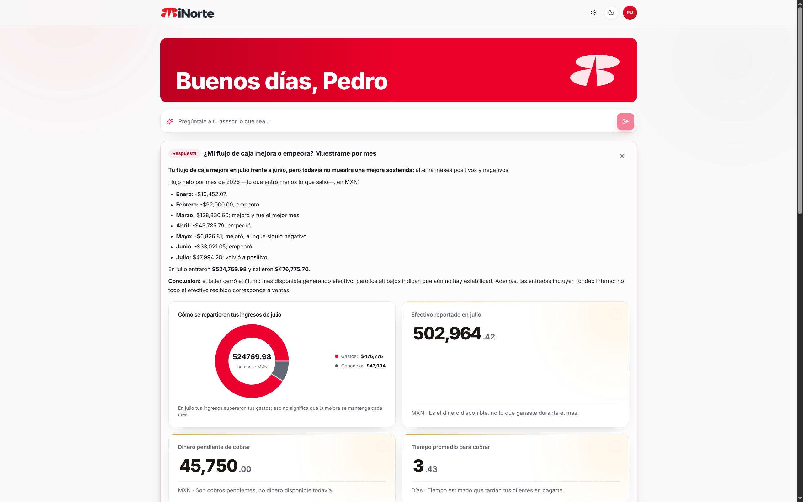
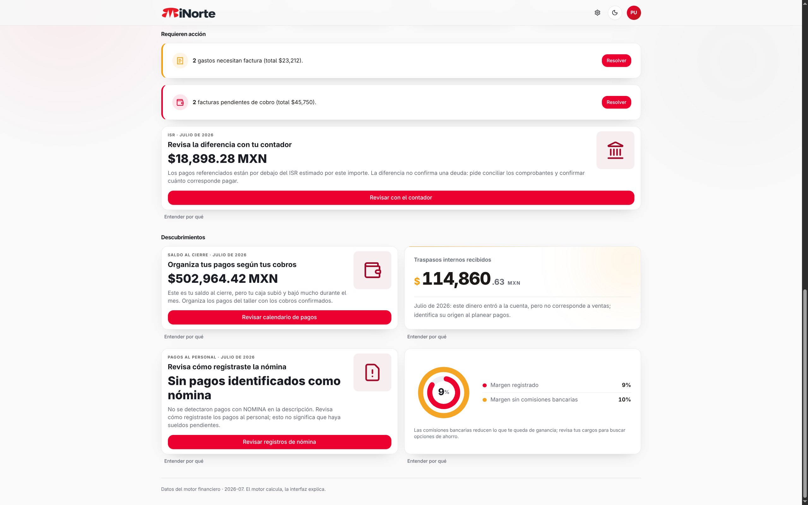

# MiNorte by Banorte 🏦🧭

> Un equipo financiero dentro de tu cuenta Banorte: entiende, explica y actúa.
> Las PyMEs no necesitan que decidan por ellas — necesitan un **norte**.

MiNorte convierte los movimientos bancarios de una PyME en decisiones claras:
dashboard generativo semanal, consultor con IA que calcula escenarios reales,
cobranza con emails de verdad y facturación asistida. Todo número que ves
viene de un motor determinista; la IA interpreta, nunca inventa.

## ✨ Qué hace

- 📊 **Dashboard vivo** — 4 métricas ancla con comentarios + acciones + descubrimientos que rotan cada semana. Nunca es el mismo dos veces.
- 🧠 **Analista financiero** — 10 insights rankeados con evidencia citada del motor.
- 🎨 **UI generativa** — un Diseñador convierte insights en tarjetas de un catálogo validado (gráficas obligatorias, footnote en español simple).
- 💬 **Consultor** — chat que responde con cifras exactas, evalúa contrataciones/gastos y compara créditos con CAT.
- 📧 **Cobranza** — detecta CxC vencidas y envía recordatorios reales (Resend) con guardas de confirmación y 24h.
- 🧾 **Tickets** — foto de ticket → extracción → CFDI (browser agent con frenos humanos).

## 🏗️ Arquitectura

Next.js 14 → FastAPI → Supabase Postgres
                ↓
     Financial Engine (determinista, 0 LLM)
                ↓
     MCP in-process (19 tools: banca, SAT, finanzas, cobranza)
        ↙              ↓               ↘
  Consultor      Analista → Diseñador → Composición

**Regla de oro:** *el software determina qué es verdad; la IA determina cómo explicarlo.*

## 📸 Producto


*El Asesor responde con análisis y tarjetas visuales: dona de ingresos vs gastos, efectivo, CxC y DSO.*


*Tu semana financiera: acciones pendientes (facturas, cobranza, ISR) + descubrimientos con gráficas.*

## 🚀 Quickstart

```bash
# 1. Clona y configura
git clone https://github.com/pedroolib/MiNorte-by-Banorte.git
cd MiNorte-by-Banorte
cp .env.example .env   # llena SUPABASE_* y OPENAI_API_KEY

# 2. Base de datos (Supabase → SQL Editor, en orden)
#    apps/api/migrations/001_core.sql … 013_tickets.sql

# 3. Levanta todo
make dev   # api :8000 · web :3000

# 4. Carga datos demo (u omite: la app trae seed)
#    Ver scripts/build_*.py para el flujo piloto completo
✅ Verificación
make test          # suite backend (190+ tests)
pnpm --dir apps/web typecheck
pnpm --dir apps/web build
📚 Docs
- docs/estado-proyecto.md (docs/estado-proyecto.md) — estado por tiers y decisiones.
- docs/ui-schema.md (docs/ui-schema.md) — contrato del catálogo generativo (para frontend).
- specs_de_minorte.md (specs_de_minorte.md) — spec original del producto.
🗺️ Roadmap
- Motor + reconciliación + MCP + 3 agentes + composición semanal
- Cobranza real + tickets/CFDI + dashboard generativo
- Auth + RLS endurecido
- Página del dashboard generativo con DynamicUI
- Deploy a producción
